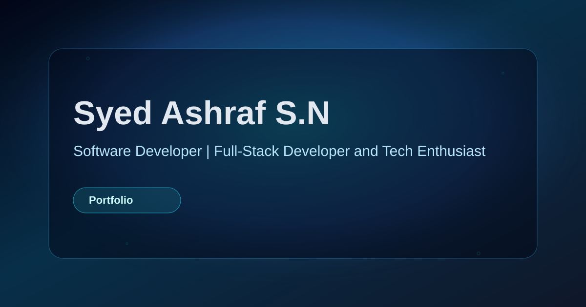

<div align="center">

<a href="https://github.com/SyedAshraf49/Portfolio">
  
</a>

# Syed Ashraf S.N.

### Full-stack developer building intelligent, safer, and production-ready software.

<p>
  <a href="https://ashraf-portfolio49.vercel.app/">View portfolio</a>
  ·
  <a href="https://github.com/SyedAshraf49">GitHub profile</a>
  ·
  <a href="mailto:galladeashraf@gmail.com">Contact me</a>
</p>

<p>
  
  
  
</p>

</div>

## Profile

I am **Syed Ashraf**, a software developer focused on the intersection of **machine learning, backend systems, and user experience**. I build practical applications that turn complex workflows into clear, dependable products.

My recent work includes AI safety tooling, prediction systems, staff-management dashboards, secure access control, REST APIs, and responsive interfaces. I care about security by default, measurable iteration, and shipping software that is useful beyond a demo.

> **Core focus:** AI/ML safety, intelligent decision-support systems, secure backend development, and thoughtful full-stack delivery.

## What I build

| Area | Capabilities | Evidence in this portfolio |
| --- | --- | --- |
| **Intelligent systems** | Classification, prediction, preprocessing, model iteration, and AI-assisted workflows | Career Path Predictor and machine-learning projects |
| **Safer systems** | Toxicity detection, content moderation, RBAC, input validation, and responsible AI | HateShieldAI and the CMRL IT Wing dashboard |
| **Usable systems** | React interfaces, responsive layouts, REST API integration, and clear interaction design | Portfolio UI, dashboards, and project applications |

## Selected work

| Project | Description | Links |
| --- | --- | --- |
| **HateShieldAI** | AI safety tooling for toxicity detection, moderation checks, and safer content workflows. | [Repository](https://github.com/SyedAshraf49/HateSheildAI-CLI) · [Live demo](https://hatesheildai-v3.onrender.com/) |
| **Career Path Predictor** | A machine-learning application that analyzes profile inputs and recommends suitable career directions. | [Repository](https://github.com/SyedAshraf49/Carrer-Path-Predictor-FI) · [Live demo](https://carrer-path-predictor-fi.onrender.com/) |
| **Local Vendor** | A platform concept for connecting local vendors with customers through streamlined discovery. | [Repository](https://github.com/SyedAshraf49/Local-Vendor__) · [Live demo](https://local-vendor-v2.vercel.app/) |
| **CMRL IT Wing Reminder Dashboard** | An internal staff-management dashboard built during my software development internship. | [Repository](https://github.com/Mukesh-sankaran/Reminder-dashboard-cmrl-itwing) |

For the interactive experience, visit the [live portfolio](https://ashraf-portfolio49.vercel.app/).

## Experience

### Software Development Intern — IT Wing

**Chennai Metro Rail Limited · Nandanam, Chennai · January–February 2026**

Built and secured a staff-management dashboard for an IT department serving more than 200 employees. The work included streamlined data retrieval, role-based access control, department-level data segregation, backend validation, input sanitization, and exposure to enterprise government IT infrastructure.

**Technology:** Python · Flask · Flask-CORS · SQL · HTML5 · CSS3

[View the project repository](https://github.com/Mukesh-sankaran/Reminder-dashboard-cmrl-itwing)

### Project Lead — Machine Learning & Deep Learning Intern

**G-TEC Computer Education · Anna Nagar, Chennai · June–July 2025**

Led the development of a Career Path Prediction System and coordinated teams across frontend development, data collection and preprocessing, backend development, and testing. The project used iterative model tuning and applied classification and regression techniques to a real-world prediction problem.

**Technology:** Python · Flask · scikit-learn (Random Forest) · Joblib · HTML5 · CSS3 · JavaScript · CSV-based datasets

[View the project repository](https://github.com/SyedAshraf49/Career-Path-Predictor-V1)

## Certifications

Recent credentials across artificial intelligence, generative AI, and practical engineering include:

- **AI Fluency Framework & Foundations** — Anthropic, July 2026
- **AI Fluency for students** — Anthropic, July 2026
- **Getting Started with Artificial Intelligence** — IBM, July 2025
- **Generative AI in Action** — IBM, August 2025
- **Code Generation and Optimization Using IBM Granite** — IBM, August 2025
- **Data Classification and Summarization Using IBM Granite** — IBM, August 2025

Credential IDs are displayed in the live portfolio’s Certifications section.

## Technology stack

<div align="center">


</div>

| Layer | Implementation |
| --- | --- |
| UI | React 18 and TypeScript |
| Build | Vite |
| Styling | Tailwind CSS and focused component stylesheets |
| Motion | Framer Motion, GSAP, Anime.js, and CSS transitions |
| Icons | Lucide React |
| Deployment | Vercel |

## Run locally

```bash
git clone https://github.com/SyedAshraf49/Portfolio.git
cd Portfolio
npm install
npm run dev
```

The development server is available at `http://localhost:5173`. Create a production build with:

```bash
npm run build
```

## Repository structure

```text
Portfolio/
├── public/
│   ├── favicon.svg
│   ├── og-cover.svg
│   ├── project-images/
│   └── resume/
├── src/
│   ├── components/
│   │   ├── sections/       # Experience, skills, certifications, contact
│   │   ├── ui/              # Hero, dock, navigation, background, scrollbar
│   │   └── common/          # Shared UI primitives
│   ├── constants/           # Portfolio content and navigation data
│   ├── hooks/               # Theme and contact form behavior
│   ├── App.tsx              # Page composition
│   └── index.css            # Global theme and layout styles
├── index.html
├── package.json
├── tsconfig.json
├── vercel.json
└── vite.config.ts
```

## Resume and contact

- [Download résumé](./public/resume/Syed%20Ashraf%20S%20N%20Resume.pdf)
- [Email](mailto:galladeashraf@gmail.com)
- [GitHub](https://github.com/SyedAshraf49)
- [LinkedIn](https://linkedin.com/in/syedashraf49)
- [Instagram](https://www.instagram.com/asher49_)

## License

This project is available under the MIT License.

<div align="center">

<br />

**Building intelligent systems with care, clarity, and purpose.**

</div>
